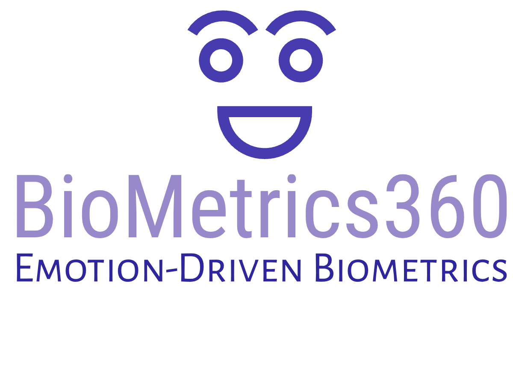

# Emotion Recognition and Worker Identification



This project is developed as part of the AI-Challenge by Arkangel AI. It aims to develop a computer vision model for recognizing workers of a company while detecting their emotions.

## Table of Contents
- [Features](#features)
- [Getting Started](#getting-started)
  - [Prerequisites](#prerequisites)
  - [Installation](#installation)
- [Usage](#usage)
- [Demo](#demo)
- [Project Structure](#project-structure)
- [Contact](#contact)

## Features
- Worker recognition and emotion detection.
- Cloud deployment for easy accessibility.
- Web-based user interface for making inferences.

## Getting Started
Follow these instructions to set up and run the project on your local machine.

### Prerequisites
- Python 3.x
- Flask
- Pillow
- requests

### Installation
1. Clone the repository:
   ```bash
   git clone https://github.com/YourUsername/YourRepository.git
   cd YourRepository
